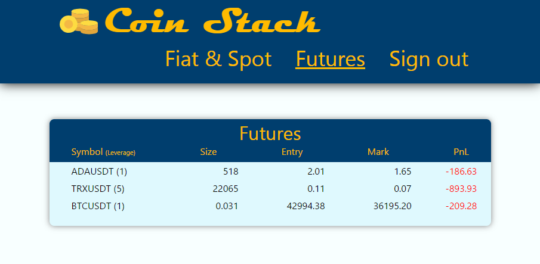
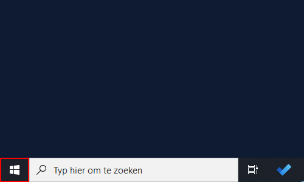
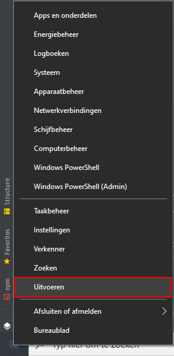
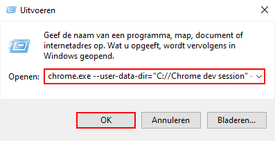

# Coin Stack

Coin Stack is er voor kleine beleggingsgroepjes die op het platform Binance actief zijn.
Door gebruik te maken van Coin Stack kan niet alleen de beheerder van het vermogen maar ook de aandere deelnemers inzicht krijgen wat er gebeurd op Binance.
En dit zonder te hoeven inloggen op Binance.

De beheerder vult eenmalig de API keys in welke in Binance zijn aangemaakt, let hierbij op dat je de keys aanmaakt met de 'read-only' en 'futures trading' opties geactiveerd.
Vervolgens deelt de beheerder de inloggegevens met de deelnemers. 

Coin Stack haalt de data via de Binance API op en geeft deze in een makkelijk overzicht weer op zowel pc als mobiel.
In de huidige versie zijn alleen de spot assets en futures zichtbaar. Bij de futures word de marktwaarde (Mark) en winst of werlies (PnL) iedere 5 seconde bijgewerkt.

Binnenkort zijn hier ook de openstaande orders, historie en totale waardes van alle bezitten in te zien. Later worden ook grafieken toegevoegd welke per asset of future te bekijken zijn.

Uiteindelijk moet ook iedere deelnemer apart kunnen inloggen met een eigen account, de beheerder kan dan toestemming geven met wie de gegevens gedeeld worden.

### Instalatie

Instaleer de node modules door het volgende commande in de terminal te runnen:

`npm install`

Instaleer React Router Dom met het volgende commando:

`npm install react-router-dom`

Instaleer vervolgens de Binance node api met het volgende commando in te terminal:

`npm install node-binance-api`

Instaleer Firebase voor de authenticatie:

`npm install firebase`

Start vervolgens de app met het volgende commando:

`npm start`

### Inlog en API gegevens

Gebruik de volgende gegevens om in te loggen:

Email:          user@coin-stack.nl
Wachtwoord:     welkom1

API keys: 
REACT_APP_TEST_API_KEY=cASw5IjETig3NInj8Ylt4odRlpo9aXe3dKaX85YddParq5ZGX095DRITu6DC1cmY 
REACT_APP_TEST_SECRETKEY=ITDSocDMGiVxIcXoCt8fu16MFgsEKmlPdqFtDyj5gxEr6H5jE06DVKnjim534Zpt 
REACT_APP_F_TEST_API_KEY=d609c5e29181b0ec740e2370b1ef6ee2f4038573cf2657cfe74481863670d2de 
REACT_APP_F_TEST_SECRETKEY=2335334d747e7863891f0543a5b40cff432740673891343b537a8b52f248d226 

(REACT_APP_APIKEY & REACT_APP_SECRETKEY kun je leeg laten voor testgebruik, deze vul je in met API keys gemaakt in Binance)

### Limitaties

Door het CORS (Cross-origin resource sharing) beleid wat Binance hanteerd is op en moment een browser met een uitgeschakeld web-security nodig.
Er word nog gewerkt aan een oplossing, echter weet ik nog weinig hoe ik CORS moet implementeren/omzeilen.

Om de app nu werkend te zien moet je chrome opstarten met de volgende startoptie:

`--user-data-dir="C://Chrome dev session" --disable-web-security`

Op Windows voer de volgende handelingen uit om chrome op te starten zonder web-security:

Rechtermuis op het windowslogo. 

Kies voor 'uitvoeren'. 

Kopieer de volgende regel en plak deze in het vak 'Openen:', klik vervolgens op 'OK'. 
`chrome.exe --user-data-dir="C://Chrome dev session" --disable-web-security`

Chrome is nu opgestart zonder web-security.

Als de app gestart is via `npm start` ga naar [http://localhost:3000/futures](http://localhost:3000/futures)